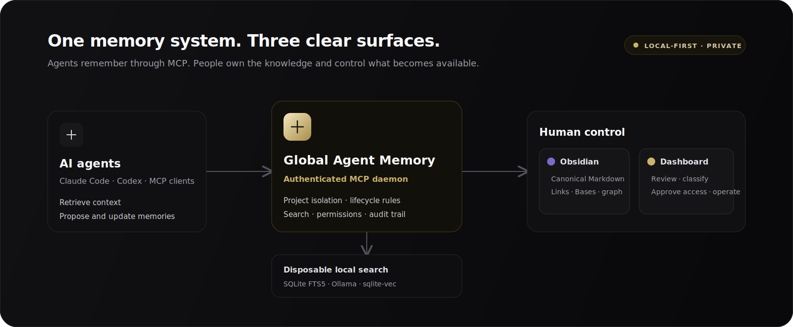
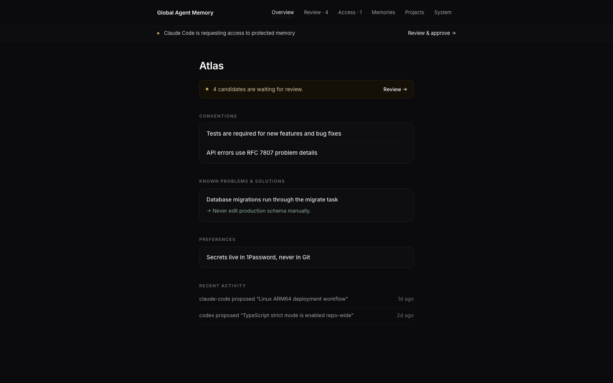
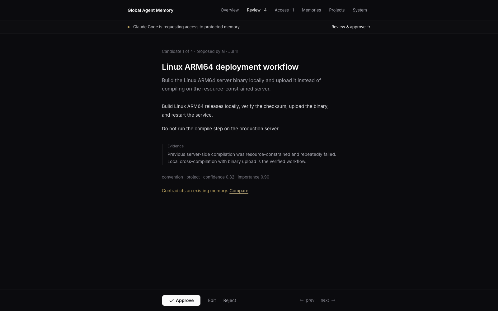
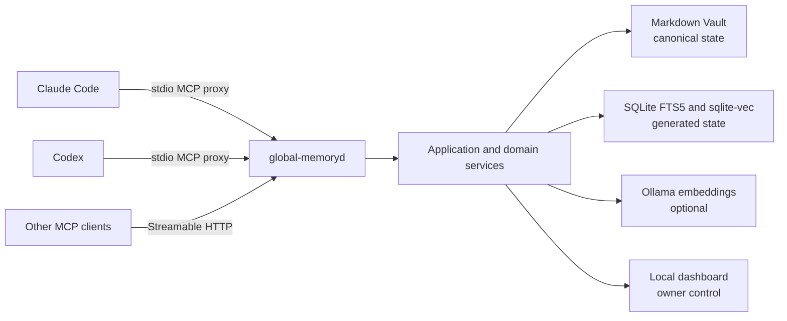

<!-- markdownlint-disable MD013 -->

# Global Agent Memory

<!-- mcp-name: io.github.ozankasikci/global-agent-memory -->

> Local-first, project-aware, durable memory for Claude Code, Codex, and other
> MCP-compatible agents.

[](https://www.python.org/downloads/)
[](docs/mcp-contract-v1.md)
[](#security-model)
[](pyproject.toml)
[](https://github.com/ozankasikci/global-agent-memory/releases/latest)

Global Agent Memory gives multiple coding agents one shared, reviewable memory without
handing control of your knowledge base to a hosted service. Markdown files are
canonical, an authenticated local MCP daemon is the public agent interface, and the
dashboard lets a human approve, edit, protect, or remove what agents remember.

**One Vault. Multiple agents. Human-controlled memory.**



[Quick start](#quick-start) · [Obsidian Vault](#obsidian-vault) ·
[Dashboard](#dashboard) · [How it works](#how-it-works) ·
[Security](#security-model) · [MCP contract](#mcp-interface) · [Documentation](#documentation)

## Why Global Agent Memory?

Coding agents are useful inside a session, but important context is often lost between
sessions or fragmented across individual clients. Global Agent Memory provides a durable
layer for knowledge such as:

- architectural decisions and project conventions;
- verified workflows and operational runbooks;
- recurring problems and their proven solutions;
- project preferences, entities, and handoff summaries;
- bounded context for a new task or agent session.

Agents propose memories as **candidates**. A human reviews them before they become
durable, controls their visibility, and can later update, supersede, archive, or
hard-delete them.

### How it compares

| Approach | Shared across agents | Human-reviewable | Project-aware | Owner-controlled access | Portable source of truth |
| --- | :---: | :---: | :---: | :---: | :---: |
| `CLAUDE.md` / `AGENTS.md` | Limited | ✓ | ✓ | — | ✓ |
| Basic memory MCP | ✓ | Varies | Varies | Varies | Varies |
| Hosted agent memory | ✓ | Varies | ✓ | Provider-defined | — |
| **Global Agent Memory** | **✓** | **✓** | **✓** | **✓** | **Markdown** |

Use project instruction files for compact rules that always belong in a prompt. Use
Global Agent Memory when knowledge should be searchable, shared between clients,
reviewed by a person, updated over time, or hidden behind explicit permission.

## Highlights

- **Shared across agents** — Claude Code, Codex, and other MCP clients use the same
  service and immutable memory IDs.
- **Project-aware by default** — Git roots, remotes, aliases, and the project registry
  keep retrieval scoped to the active project.
- **Markdown is canonical** — the Vault remains readable, portable, backup-friendly, and
  usable with Obsidian.
- **Human review workflow** — agents create candidates; owners approve, edit, reject, or
  resolve conflicts in the dashboard.
- **Protected and sealed memory** — sensitive knowledge can be excluded from ordinary
  retrieval and placed behind owner-controlled access.
- **Hybrid local search** — SQLite FTS5 provides keyword retrieval; optional Ollama
  embeddings and `sqlite-vec` add semantic ranking.
- **Offline-friendly** — keyword search and lifecycle operations continue when Ollama is
  unavailable.
- **Rebuildable generated state** — SQLite, FTS, vectors, queues, and caches can be
  recreated from Markdown.
- **Frozen MCP V1 contract** — tools, resources, prompts, envelopes, and compatibility
  rules are versioned in the repository.
- **Local security boundary** — the daemon binds to `127.0.0.1` and requires a generated
  bearer token stored outside the Vault.

### Built for real project vaults

The opt-in performance suite creates **10,000 synthetic memories** and exercises the
same indexing and retrieval paths used by the daemon. On the recorded macOS ARM64
baseline, a full rebuild takes 36.5 seconds, warm keyword search P95 is 56 ms, warm
hybrid search P95 is 76 ms, and incremental stdio proxy overhead is 1.5 ms. Results vary
by machine; the changed-note, search, and proxy budgets run as regression gates. See the
[methodology and complete baseline](docs/performance-baseline.md).

## Three surfaces, one memory system

Global Agent Memory is more than an MCP server. Agents, owners, and knowledge workers
use the same canonical memories through three purpose-built surfaces:

| Surface | Designed for | What it provides |
| --- | --- | --- |
| **MCP** | Claude Code, Codex, and other agents | Project-aware context, search, candidate creation, safe updates, lifecycle actions, and permission requests through a frozen V1 contract |
| **Obsidian Vault** | Reading, writing, linking, and long-term knowledge ownership | Portable Markdown and YAML, templates, native Bases views, project overview hubs, wikilinks, backlinks, graph navigation, and direct-edit synchronization |
| **Local dashboard** | Fast owner review and administration | Candidate approval and editing, conflict comparison, visibility classification, protected-access decisions, search, projects, activity, backups, and system health |

The Vault is the durable source of truth. The dashboard is a complementary control
plane, and the MCP interface is the safe automation layer used by agents. You can use
Obsidian, the dashboard, or both without creating separate copies of your memory.

### Dashboard at a glance



<p align="center"><sub>Real dashboard UI with synthetic Atlas project data. No private Vault content is shown.</sub></p>

## Quick start

This is the shortest path to persistent memory for Claude Code, Codex, and other MCP
clients. The guided installer creates the local service, Obsidian-compatible Vault,
dashboard, MCP registrations, and agent skills together.

### Requirements

- macOS or Linux
- Python 3.12 or newer
- [`uv`](https://docs.astral.sh/uv/)
- Claude Code or Codex for the managed client integrations
- Optional: [Obsidian](https://obsidian.md/) for browsing the Markdown Vault
- Optional: [Ollama](https://ollama.com/) for semantic retrieval

### 1. Install

```shell
uv tool install git+https://github.com/ozankasikci/global-agent-memory.git
```

For a local checkout, use `uv tool install .` instead.

### 2. Run guided setup

```shell
global-memory setup
```

Setup shows one plan and asks once before it changes anything. It initializes the local
Vault, creates the protected token, installs and starts the native per-user service,
detects Claude Code and Codex, installs their MCP integrations and skills, verifies
healthy clients, and opens the dashboard. The command is idempotent, so running it again
repairs or updates managed components without replacing unrelated client configuration.

Use flags when you need a non-default setup:

```shell
# Non-interactive installation
global-memory setup --yes

# Choose a different Vault on first setup
global-memory setup --vault "$HOME/Memory"

# Install only one client, or no client yet
global-memory setup --clients claude-code
global-memory setup --clients none

# Preview without changing files or services
global-memory setup --dry-run
```

### 3. Use the installed agent shortcuts

Setup installs five basic shortcuts for each detected client:

| Shortcut | Purpose |
| --- | --- |
| `gam-context` | Load project-aware context for a task |
| `gam-search` | Find a decision, fact, error, convention, or solution |
| `gam-remember` | Propose explicitly supplied durable knowledge as a candidate |
| `gam-review` | Show the candidate queue without changing it |
| `gam-dashboard` | Open the authenticated dashboard |

In Claude Code, invoke them directly, for example `/gam-context fix the upload retry bug`.
In Codex, type `/skills` and choose one, or mention it directly, for example
`$gam-context fix the upload retry bug`.

### 4. Open the dashboard again

```shell
global-memory dashboard
```

You can also ask a connected agent:

> Open the Global Agent Memory dashboard.

The agent calls `memory_dashboard_open` and opens the same authenticated local
dashboard.

### Manual installation and repair

The individual commands remain available for advanced setups and troubleshooting:

```shell
global-memory init --vault "$HOME/Documents/Global Agent Memory"
global-memory daemon install-service --kind launchd  # use systemd on Linux
global-memory integrations install all
global-memory integrations verify all
global-memory doctor
```

## Using it with an agent

After integration, you normally describe your intent instead of running memory commands
manually.

### Retrieve context before work

> Before you start, load the relevant memory for this project and summarize the
> conventions and recent decisions.

### Propose a durable memory

> Remember that production ARM64 binaries must be built locally and uploaded to the
> server. Add it as a project convention with the deployment discussion as evidence.

The agent creates a candidate. Nothing becomes active until it is approved.

### Update existing knowledge

> Find the deployment memory and update it with the new health-check command. Do not
> create a duplicate.

### Open the review surface

> Open the memory dashboard so I can review the candidates.

The shared integration skill teaches supported agents when to retrieve, propose, update,
and avoid duplicating memory.

## Obsidian Vault

The configured Obsidian Vault is the human-readable, durable source of truth—not an
export of an opaque database. Every managed memory is a normal Markdown file with YAML
properties, a stable memory ID, lifecycle metadata, and project-aware links.

Initialization adds an Obsidian workspace without replacing your existing files:

- templates for decisions, facts, solutions, conventions, preferences, entities,
  references, session summaries, and project overviews;
- native Bases views for the candidate review queue, active knowledge, recent updates,
  decisions by project, verified solutions, and lifecycle history;
- project overview hubs that embed project memories and remain stable as notes move
  through candidate, active, rejected, superseded, or archived folders;
- wikilinks and reciprocal supersession links for backlinks and graph navigation;
- watcher synchronization, so ordinary content and descriptive-property edits made in
  Obsidian become searchable without restarting the service.

Obsidian is optional: the same Markdown remains readable and editable with any text
editor. Lifecycle and access-policy changes should still go through the dashboard, MCP,
or CLI so validation, optimistic concurrency, and audit records remain intact.

## Dashboard

The authenticated dashboard is the owner control plane for:

- project overview and recent project activity;
- one-at-a-time candidate review and editing;
- duplicate and conflict comparison;
- memory search and lifecycle management;
- Standard, Protected, and Sealed classification;
- access-request approval and active-grant revocation;
- sealed-memory owner unlocks with audit records;
- project switching, system health, reindexing, and backups;
- opening canonical Markdown in Obsidian or the local file viewer.



<p align="center"><sub>Candidate review keeps evidence and conflicts visible before an owner approves durable memory.</sub></p>

Dashboard launch URLs expire after 60 seconds, can be exchanged only once, and create a
local HttpOnly session. Do not share a launch URL.

## Memory visibility and access

| Level         | Default agent behavior                                                           | Owner control                                                                     |
| ------------- | -------------------------------------------------------------------------------- | --------------------------------------------------------------------------------- |
| **Standard**  | Included in ordinary scoped retrieval                                            | Normal candidate and lifecycle review                                             |
| **Protected** | Excluded from default results; an agent receives only a neutral relevance signal | Owner selects exact memories, permission, duration, policy, and eligible projects |
| **Sealed**    | Body is not indexed or returned through agent tools                              | One owner-unlocked dashboard view; every access is audited                        |

Protected grants are scoped by purpose, project, agent, permission, exact memory IDs,
and duration. Owners may downgrade a request but never elevate it. Agents may request
and poll for access, but they cannot approve, deny, or revoke grants.

> [!IMPORTANT]
>
> Protected and Sealed memory are not secret managers. Never store passwords,
> credentials, private keys, API keys, or bearer tokens in Global Agent Memory.

## How it works



The daemon is the single owner of the Vault watcher, generated indexes, embedding queue,
and MCP transport. Streamable HTTP clients connect directly on localhost; stdio-only
clients launch the thin `global-memory-mcp` proxy. Both paths expose the same MCP V1
contract. Requests are stateless because durable memory belongs to the shared daemon
rather than to an expiring client session, which keeps long-lived agent bridges reliable
across idle periods.

The dependency direction is:

```text
transport and client adapters → application services → domain
```

Vault, SQLite, vectors, embeddings, Git, Watchdog, and client integrations are adapters.
The domain layer does not depend on them.

## MCP interface

The MCP interface is the only public AI-facing API. Clients do not read the Vault,
SQLite database, vectors, token, or runtime logs directly.

The frozen V1 discovery snapshot currently contains **17 tools**, **10 resources**, and
**6 prompts**.

| Capability                | MCP tools                                                                                                   |
| ------------------------- | ----------------------------------------------------------------------------------------------------------- |
| Retrieval                 | `memory_search`, `memory_context`, `memory_get`, `memory_status`                                            |
| Candidate and lifecycle   | `memory_remember`, `memory_update`, `memory_approve`, `memory_reject`, `memory_supersede`, `memory_archive` |
| Navigation and operations | `memory_open`, `memory_dashboard_open`, `memory_reindex`, `memory_projects`, `memory_tags`                  |
| Protected access          | `memory_access_request`, `memory_access_status`                                                             |

All mutations are replay-safe through `request_id`. Updates use optimistic concurrency,
and a stale version fails with `VERSION_CONFLICT` instead of silently overwriting newer
knowledge.

See [MCP Contract V1](docs/mcp-contract-v1.md) and the generated
[`contracts/mcp/v1/`](contracts/mcp/v1/) schemas for the complete contract.

## CLI examples

The CLI uses the same MCP path as connected agents; it does not bypass the daemon to
read generated state.

```shell
# Check health
global-memory status
global-memory doctor

# Register and detect a project
global-memory project add my-project --root "$HOME/Projects/my-project"
global-memory project detect "$HOME/Projects/my-project"

# Search and build bounded task context
global-memory search "deployment rollback" --project my-project
global-memory context "Prepare the next release" --project my-project --token-budget 3000

# Create a review candidate
global-memory remember \
  "Release rollback procedure" \
  "Use the blue-green rollback task and verify both health endpoints." \
  --type reference \
  --scope project \
  --project my-project

# Rebuild generated indexes
global-memory reindex --full

# Back up canonical Markdown
global-memory backup "$HOME/Backups/global-agent-memory.zip"
```

Run `global-memory --help` or `global-memory <command> --help` for the complete command
reference.

## Security model

Global Agent Memory is designed as a local service, not a remotely exposed memory API.

- The daemon is restricted to `127.0.0.1`.
- Streamable HTTP requires a generated local bearer token.
- The token, database, logs, locks, and generated state remain outside the Vault.
- Token files use user-only permissions.
- Dashboard sessions are short-lived, local, and HttpOnly.
- Paths are confined to the configured Vault and checked against traversal and symlink
  escape.
- Ordinary logs redact bodies, prompts, embeddings, secrets, and authorization material.
- Generated state can be removed and rebuilt from canonical Markdown.
- Agent-facing retrieval is fail-closed for Protected and Sealed memories.

Please report security issues according to [SECURITY.md](SECURITY.md).

## Development

Clone the repository, then install Python and dashboard dependencies:

```shell
uv sync
npm ci --prefix dashboard
```

Run the standard quality gate:

```shell
make check
```

The gate covers Ruff formatting and linting, strict MyPy, the TypeScript production
build, unit/integration/contract/E2E tests, coverage, and deterministic MCP contract
regeneration.

Useful focused commands:

```shell
make unit
make integration
make contract
make e2e
make dashboard-check
make performance   # opt-in 10,000-note performance suite
```

When changing the MCP contract:

```shell
make contract-generate
make contract-check
```

Contributions are welcome. Start with [CONTRIBUTING.md](CONTRIBUTING.md), and keep
changes compatible with the frozen V1 contract unless a parallel major contract is
intentionally introduced.

## Community and roadmap

- Ask usage questions and share agent workflows in
  [GitHub Discussions](https://github.com/ozankasikci/global-agent-memory/discussions).
- Pick up a scoped contribution from the
  [`good first issue`](https://github.com/ozankasikci/global-agent-memory/labels/good%20first%20issue)
  or [`help wanted`](https://github.com/ozankasikci/global-agent-memory/labels/help%20wanted)
  queues.
- Follow planned distribution, security, and integration work on the
  [public roadmap](https://github.com/ozankasikci/global-agent-memory/issues?q=is%3Aissue%20state%3Aopen%20label%3Aroadmap).
- If the project is useful, starring the repository helps other agent-tooling users
  discover it.

## Documentation

| Guide                                                                 | Purpose                                                                               |
| --------------------------------------------------------------------- | ------------------------------------------------------------------------------------- |
| [Operations](docs/operations.md)                                      | Installation, daemon management, diagnostics, backup, restore, upgrades, and recovery |
| [Claude Code](docs/claude-code.md)                                    | Managed skill and MCP registration for Claude Code                                    |
| [Codex](docs/codex.md)                                                | Managed skill and MCP registration for Codex                                          |
| [Architecture](docs/architecture.md)                                  | Dependency direction and daemon ownership model                                       |
| [Configuration](docs/configuration.md)                                | Platform-native locations, environment variables, and security defaults               |
| [MCP Contract V1](docs/mcp-contract-v1.md)                            | Public compatibility and response-envelope rules                                      |
| [Testing](docs/testing.md)                                            | Standard, performance, and live acceptance strategy                                   |
| [Performance baseline](docs/performance-baseline.md)                  | 10,000-note benchmark methodology and budgets                                         |
| [Release checklist](docs/release-checklist-v1.md)                     | Current V1 acceptance evidence and remaining release gates                            |
| [Implementation plan](<docs/global-memory-implementation-plan(1).md>) | Original product requirements and phased implementation plan                          |

## Project status

Global Agent Memory is under active V1 development and is currently intended to be
installed from source. The package version is `0.1.3`; the MCP contract version is `v1`.

The product name is **Global Agent Memory**. The technical identifiers `global-memory`,
`global-memory-mcp`, `global-memoryd`, `global_memory`, and `product: global-memory`
remain stable for V1 compatibility.

See the [V1 release checklist](docs/release-checklist-v1.md) for verified scenarios and
remaining live acceptance work.

## License

Global Agent Memory is available under the MIT license declared in
[pyproject.toml](pyproject.toml).
